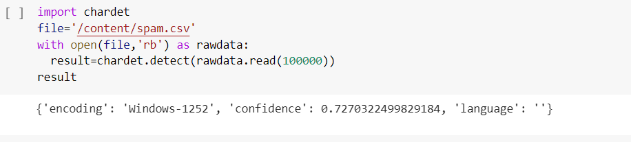
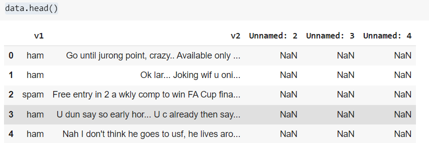
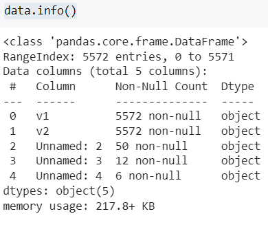
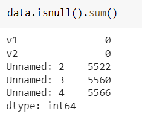
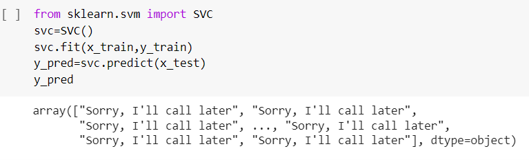
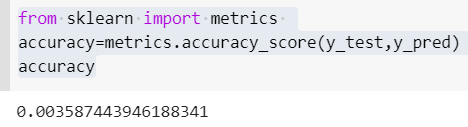

# Implementation-of-SVM-For-Spam-Mail-Detection

## AIM:
To write a program to implement the SVM For Spam Mail Detection.

## Equipments Required:
1. Hardware – PCs
2. Anaconda – Python 3.7 Installation / Jupyter notebook

## Algorithm
1. Import the required libraries.
2. Read the dataset .print the head and tail of dataset.
3. import train test split.
4. Import countervector and proceed with the detection of spam mail.

## Program:


Program to implement the SVM For Spam Mail Detection..

Developed by: M.Sowmya

RegisterNumber: 212221230107 
```
import pandas as pd
data=pd.read_csv('/content/spam.csv',encoding='Windows-1252')
import chardet
file='/content/spam.csv'
with open(file,'rb') as rawdata:
  result=chardet.detect(rawdata.read(100000))
result
data.head()
data.info()
data.isnull().sum()
x=data["v1"].values
y=data["v2"].values
from sklearn.model_selection import train_test_split
x_train,x_test,y_train,y_test=train_test_split(x,y,test_size=0.2,random_state=0)
from sklearn.feature_extraction.text import CountVectorizer
cv=CountVectorizer()
x_train=cv.fit_transform(x_train)
x_test=cv.transform(x_test)
from sklearn.svm import SVC
svc=SVC()
svc.fit(x_train,y_train)
y_pred=svc.predict(x_test)
y_pred
from sklearn import metrics 
accuracy=metrics.accuracy_score(y_test,y_pred)
accuracy
```

## Output:









## Result:
Thus the program to implement the SVM For Spam Mail Detection is written and verified using python programming.
